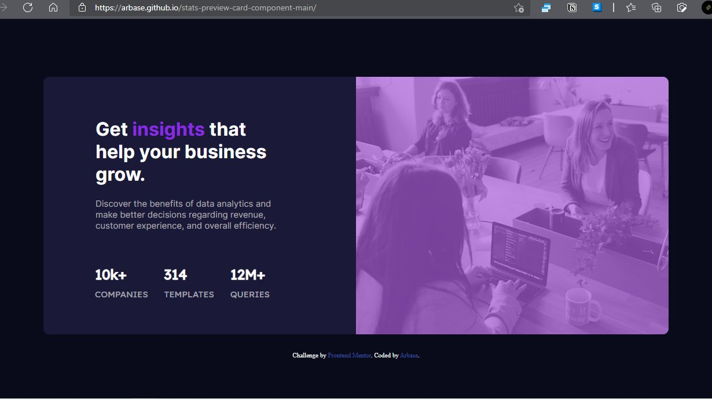

# Frontend Mentor - Stats preview card component solution

This is a solution to the [Stats preview card component challenge on Frontend Mentor](https://www.frontendmentor.io/challenges/stats-preview-card-component-8JqbgoU62). Frontend Mentor challenges help you improve your coding skills by building realistic projects. 

## Table of contents

- [Overview](#overview)
  - [The challenge](#the-challenge)
  - [Screenshot](#screenshot)
  - [Links](#links)
- [My process](#my-process)
  - [Built with](#built-with)
  - [What I learned](#what-i-learned)
  - [Continued development](#continued-development)
  - [Useful resources](#useful-resources)
- [Author](#author)
- [Acknowledgments](#acknowledgments)

## Overview

### The challenge

Users should be able to:

- View the optimal layout depending on their device's screen size

### Screenshot



### Links

- Solution URL: [Add solution URL here](https://www.frontendmentor.io/solutions/stats-preview-card-component-using-flexbox-52agszacA)
- Live Site URL: [Add live site URL here](https://arbase.github.io/stats-preview-card-component-main/)

## My process
 It takes me a week maybe to learn this because when I started this challenge I haven't learn about CSS Flexbox
 so I need to learn that first and then finally I finished this after a week, it's a fun journey.
### Built with

- Semantic HTML5 markup
- CSS custom properties
- Flexbox
- Mobile-first workflow

### What I learned

After completing this challenge I learned how to use flexbox and this is the code that I learn after completing this :

```css
#main-layout {
  display: flex;
  margin-top: 100px;
  min-height: 100%;
  width: 100vw;
  flex-wrap: wrap;
  align-items: center;
  justify-content: center;
  flex-shrink: 0;
}
```

### Continued development

I will continue this journey with frontendmentor.io, it's so fun when you have a challenge and this is the best way not to stuck in "tutorial hell". Looking forward what I can until then.

### Useful resources

- [Learn Flexbox in 15 Minutes by Web Dev Simplified](https://www.youtube.com/watch?v=fYq5PXgSsbE&t=2s) - This helped me for learning a flexbox. I really liked this pattern.
- [Basic concepts flexbox by Mozilla](https://developer.mozilla.org/en-US/docs/Web/CSS/CSS_Flexible_Box_Layout/Basic_Concepts_of_Flexbox) - This is an amazing article which helped me finally understand XYZ. I'd recommend it to anyone still learning this concept.

## Author

- Website - [Arbase](https://arbase.github.io)
- Frontend Mentor - [@yourusername](https://www.frontendmentor.io/profile/yourusername)
- Twitter - [@arbase_](https://www.twitter.com/arbase_)

## Acknowledgments

Thanks for frontendmentor.io teams that providing challenges and thanks for the community that help others, thanks to Web Dev Simplified YouTube to help me visualize the flexbox and thans to Developer Mozilla team to providing article about flexbox.
